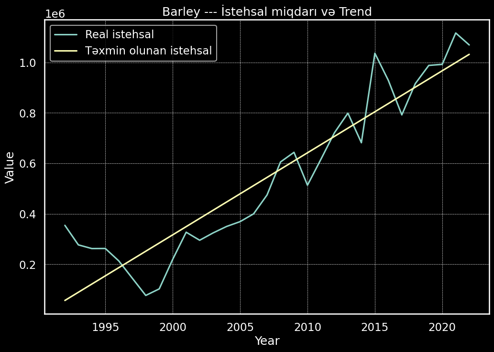
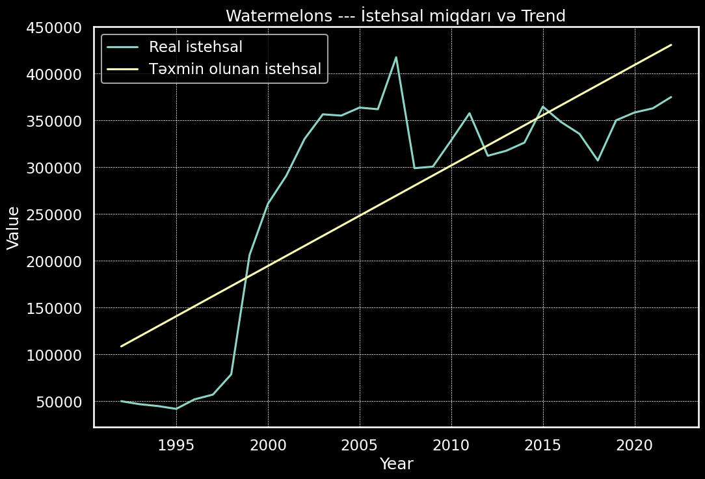
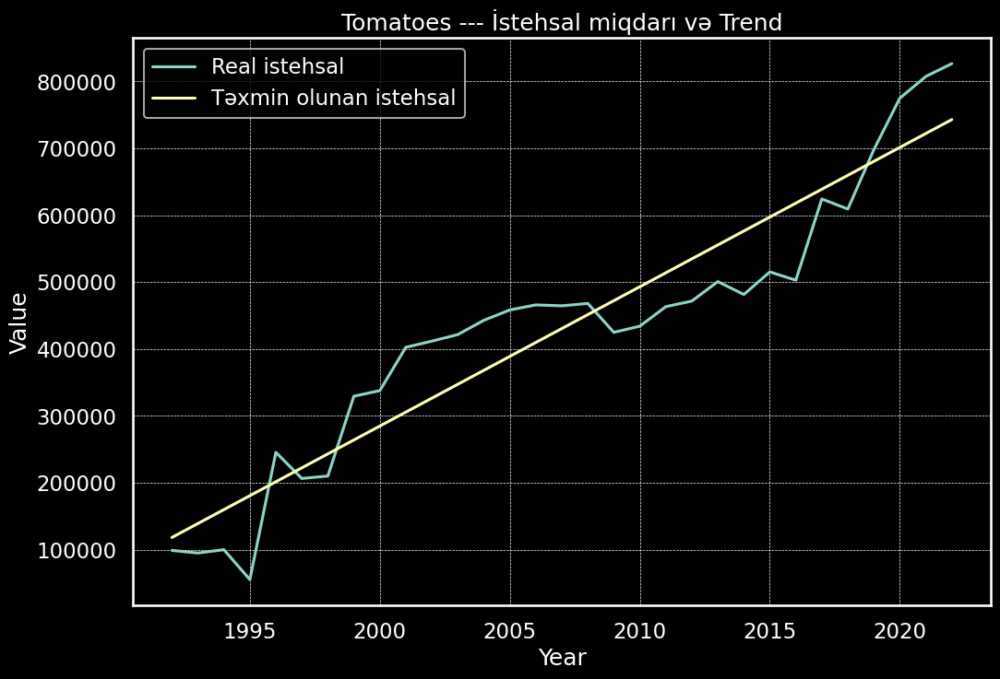
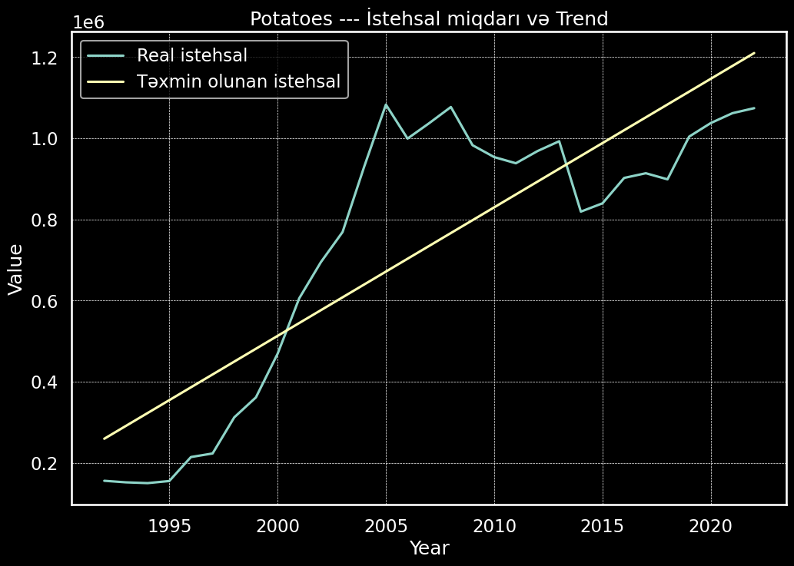
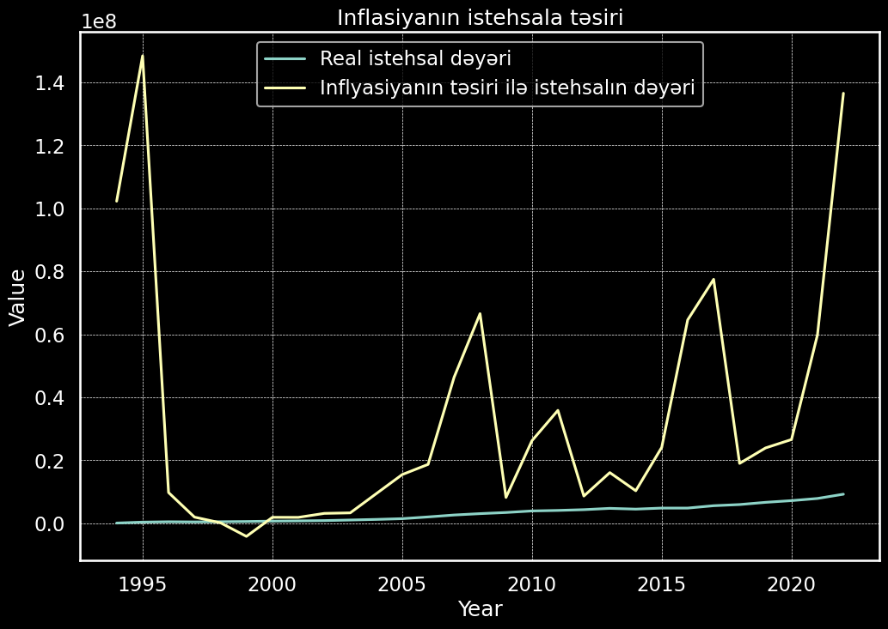
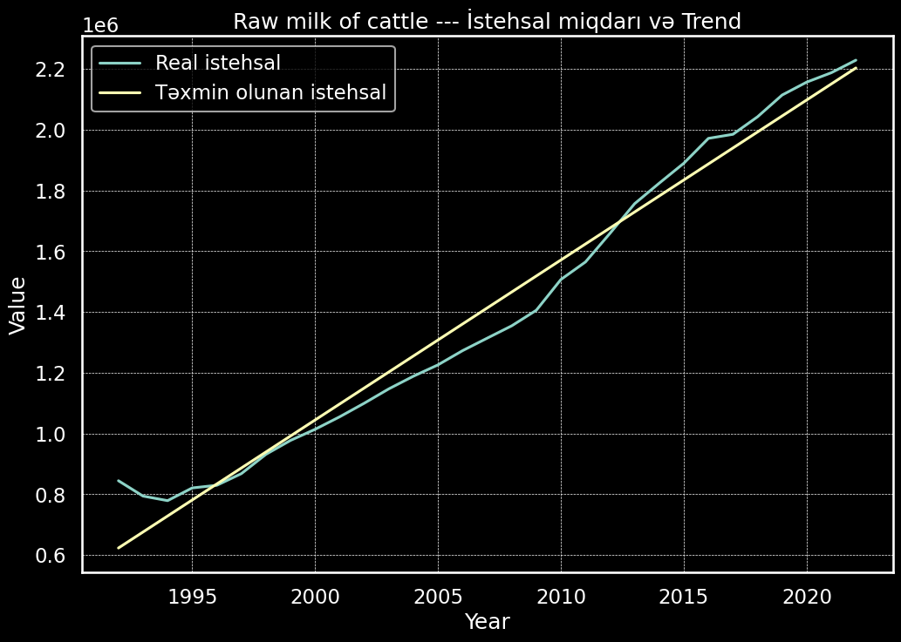

Hello 

This project includes some visualizations and comparisons about the production volume of plant and animal products in Azerbaijan.
The source of the data (CSV files) is mentioned at the end of this README.
Main Questions Answered

    I showed the yearly change (1992–2022) of Top 20 products by production volume using regression analysis and line plots.

    I checked if there is a statistical difference between two time intervals (I selected 1992–1996 and 2017–2022) using T-test.

    I analyzed how inflation affects agricultural production in different years.

 Project Structure
```markdown
analysis_of_production_data/
│
├── data/
│   ├── Azerbaijan_crops_and_livestocs_products.csv
│   ├── Azerbaijan_Value_of_Agricultural_Production.csv
│   └── inflation_azerbaijan.csv
├── visualization_file_png/
│   ├── barley.png
│   ├── watermelons.png
│   ├── tomatoes.png
│   ├── potatoes.png
│   ├── inflation_impact_production.png
│   ├── row_milk_of_cattle.png
│ 
│
├── impact_inflation_prod.ipynb
├── ttest.ipynb
├── regression_and_trend_analysis.ipynb
└── README.md
```

----------
<table>
  <tr>
    <td></td>
    <td></td>
  </tr>
  <tr>
    <td></td>
   <td></td>
  </tr>
</table>
---------
<table>
  <tr>
     <td></td>
  </tr>
  <tr>
     <td></td>
  </tr>
</table> 
---------


    Column Name Meanings (From CSV Files)
Column Name	Meaning
|Domain  Code	|Code of the data domain |
|---------------|-----------------------|
|Domain	|Name of the data domain|
|Area Code (M49) |Country code (M49 standard)|
|Area	|Country name|
|Element Code	|Code of measured variable|
|Element	|Type of measured value|
|Item Code (CPC)	|Product code|
|Item	|Product name|
|Year Code	|Year code|
|Year	|Production year|
|Unit	|Measurement unit|
|Value	|The data value|
|Flag	|Quality category flag (1 letter)|
|Flag Description	|Description of quality flag|
|Note	|Additional explanations|

     ### Flag Descriptions (Data Quality)
|Flag Description|	Meaning|
|----------------|--------|
|Imputed value|	Statistically estimated data|
|Estimated value|	Estimated with a model and assumptions|
|Unofficial value|	Data from unofficial sources|
|Missing value	|Data does not exist or is not applicable|
|Official figure	|Data from official sources|

    ###Element Descriptions
|Element|	Meaning|
|-------|----------|
|Area harvest|	Harvest area of the product|
|Yield	|Productivity / Efficiency|
|Production	|Total production volume|
|Stocks	|Count (number)|
|Yield/carcass weight	|Carcass weight|
|Producing Animals/Slaughtered|	Animals produced for slaughter|
|Asses	|Donkey count in the country (value shown in Value column)|
|inflation_rate	|Yearly inflation rate|
|Gross Production Value (current thousand SLC)|	Production value in local currency (current prices)|

    Note:

    "Gross Production Value (current thousand SLC)" means the monetary value of production using current prices.

    SLC means local currency.

    Current value means not adjusted for inflation.

Formula:

Impact of inflation on production (2020) = 
Gross Production Value (2020) × (1 + Inflation Rate (2020))

     Data Sources

         FAO - Food and Agriculture Organization of the United Nations

         World Bank (for inflation data)

     License

This project is licensed under the MIT License.
See the  file for more information.
